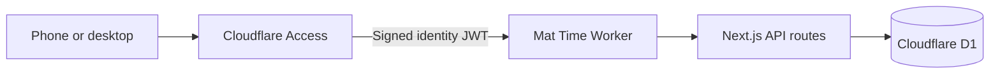

# Mat Time

<p align="center">
  
</p>

<p align="center">
  A private, mobile-friendly Brazilian Jiu-Jitsu training tracker built for logging mat time from a phone or desktop.
</p>

<p align="center">
  
  
  
  
  
</p>

## What Mat Time does

- Records whether you trained on a given day and how many hours you trained.
- Lets you edit or remove an existing daily entry by selecting that date again.
- Preserves historical annual totals for 2024 and 2025.
- Calculates current-year and all-time training totals automatically.
- Shows recent sessions in a responsive dashboard designed for phones and desktops.
- Stores data in Cloudflare D1 so it remains available across browsers and devices.
- Keeps each user's records separate using their verified Cloudflare Access identity.

## Architecture



| Layer | Technology | Purpose |
| --- | --- | --- |
| Interface | Next.js, React, TypeScript | Mobile-first training dashboard |
| Runtime | Cloudflare Workers via Vinext | Runs the full-stack application at the edge |
| Authentication | Cloudflare Access | Email-based sign-in and access policy enforcement |
| Application security | `jose` JWT validation | Independently validates the Access identity on every protected request |
| Persistence | Cloudflare D1 | Durable SQLite-compatible storage across devices |
| Schema management | Drizzle ORM and migrations | Defines, versions, and applies the database schema |

## Security model

Mat Time fails closed. Without a valid Cloudflare Access JWT, the application redirects to a locked setup page and its API refuses to read or write training data. The production Access policy should allow only the intended email address—never configure a public `Allow` policy for this personal tracker.

Cloudflare OAuth credentials and Worker secrets are stored outside this repository. The committed D1 database ID identifies the database binding but does not grant access to it.

## Data model

| Table | Contents | Key |
| --- | --- | --- |
| `yearly_totals` | One historical total for 2024 and 2025 per user | User ID + year |
| `training_sessions` | One daily session from 2026 onward, including hours trained | User ID + date |

Database constraints reject negative totals, sessions longer than 24 hours, and unsupported historical years. The checked-in migration creates the hosted schema, while defensive `CREATE TABLE IF NOT EXISTS` checks protect a newly bound database at runtime.

## Local setup

### Prerequisites

- Node.js 22.13 or later; Node.js 24 LTS is recommended.
- pnpm 11.9.0 through Corepack.
- A Cloudflare account for D1, Access, and production deployment.

Clone the repository and install its locked dependencies:

```powershell
git clone https://github.com/nicktho100/JitsTrainingTracker.git
cd JitsTrainingTracker
pnpm.cmd install --frozen-lockfile
pnpm.cmd dev
```

PowerShell users can use `pnpm.cmd` when the local execution policy blocks `pnpm.ps1`. macOS, Linux, and shells without that restriction can use `pnpm` directly.

The application requires a D1 binding and a valid Cloudflare Access identity for authenticated data operations. Local startup alone does not bypass production authentication.

## Cloudflare deployment

The complete first-time procedure is in [CLOUDFLARE_DEPLOYMENT.md](./CLOUDFLARE_DEPLOYMENT.md). At a high level:

1. Authenticate Wrangler with the device authorization flow.
2. Create the `mat-time-db` D1 database and add its ID to `wrangler.jsonc`.
3. Apply the checked-in migration to the remote database.
4. Build and deploy the Worker.
5. Protect its `workers.dev` hostname with Cloudflare Access.
6. Store the Access team domain and audience tag as encrypted Worker secrets.
7. Test persistence from both a desktop and phone.

The relevant commands are:

```powershell
pnpm.cmd cf:login
pnpm.cmd cf:whoami
pnpm.cmd cf:db:create
pnpm.cmd cf:db:migrate
pnpm.cmd deploy
```

Database creation is a one-time step. Routine application updates normally require only `pnpm.cmd deploy`; apply a new migration first whenever the database schema changes.

## Available commands

| Command | Purpose |
| --- | --- |
| `pnpm dev` | Start the Vinext development server |
| `pnpm lint` | Run ESLint across the project |
| `pnpm build` | Produce the Cloudflare-compatible production bundle |
| `pnpm test` | Run the production build as the current validation check |
| `pnpm db:generate` | Generate a Drizzle migration after a schema change |
| `pnpm cf:login` | Authenticate Wrangler using a device code |
| `pnpm cf:whoami` | Display the active Cloudflare account |
| `pnpm cf:db:migrate` | Apply pending migrations to the hosted D1 database |
| `pnpm cf:types` | Regenerate Cloudflare binding types |
| `pnpm deploy` | Build and deploy the Worker |

## Project structure

```text
app/                       Next.js pages, API routes, and Access validation
db/                        D1 queries and Drizzle schema
drizzle/                   Versioned SQL migrations and metadata
public/                    Static assets and social preview
worker/                    Cloudflare Worker entry point
wrangler.jsonc             Worker, compatibility, and D1 binding configuration
CLOUDFLARE_DEPLOYMENT.md   Detailed production deployment runbook
```

## Current scope

Version one intentionally focuses on a dependable personal training log: authentication, daily hours, historical totals, responsive access, and persistent storage. Features such as technique notes, class types, belt progression, charts, and exports can be added later without changing the core deployment model.
